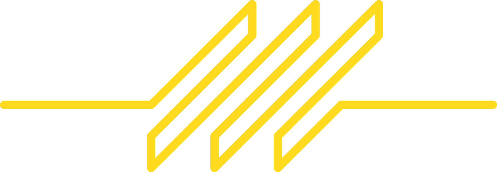

<div align="center">
	

# Line
---
### A very simple and undoubtedly very stupid remote wrapper for Roblox.
---
</div>

Usage:

*Place "Line.luau" into ReplicatedStorage*

*Create a second module in ReplicatedStorage to store your remote layout*
```lua
-- Module in ReplicatedStorage
local Line = require(game.ReplicatedStorage.Line)

 -- Return remote hierarchy table
return {
	someNamespace = {
		someEvent = Line.event()
	},

	someOtherNamespace = {
		someEvent = Line.event()
	},
}
```

*Access from server and client scripts*
```lua
-- Server Script
local Line = require(game.ReplicatedStorage.Line)

Line.someNamespace.someEvent.listen(function(client: Player, message: string)
	print(client.Name, "Said", message)
end)
```
```lua
-- Client Script
local Line = require(game.ReplicatedStorage.Line)
Line.someNamespace.someEvent.sendServer("Hello!")
```
---

Line uses additive instance naming (foolishly) so your remote hierachy can be as many namespaces deep as you wish.
---
Simple API:
```lua
-- Server
event.sendClient(client: Player, ...any)
event.sendAllClients(...any)
event.sendClientList(list: {Player}, ...any)

-- Client
event.sendServer(...any)

-- Shared
event.listen(callback: (...any) -> ())
event.once(callback: (...any) -> ())
event.wait() -> (...any)
```